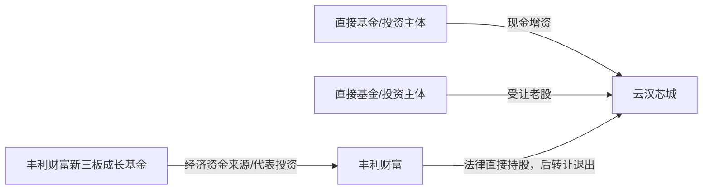

# 301563 云汉芯城招股说明书工程化研究

> 从PDF基础检查、资本事件人工标注，到股本时间线、交易原子化、PE/VC投资路径识别与确定性规则自动化的完整研究项目。

## 项目概述

本项目以《云汉芯城（上海）互联网科技股份有限公司首次公开发行股票并在创业板上市招股说明书》为唯一主要事实来源，研究对象包括公司设立以来的注册资本与股本变化、增资、股权/股份转让、关键股权结构快照、PE/VC主体及其投资路径，并将已经稳定的人工研究步骤逐步转换为可复现的程序规则。

本项目不是一次性让程序“读完整本PDF并直接给结论”，而是将研究任务拆成九个阶段：先确认文件和页码，再定位章节、识别候选事件、人工理解单个事件，最后才进行时间线、数值、路径和自动化处理。

### 事实来源与页码

- 唯一主要事实来源：`301563_云汉芯城_IPO招股说明书.pdf`
- PDF总页数：443页
- 已确认页码规则：`PDF阅读器页码 = 正文印刷页码 + 1`
- 招股说明书PDF SHA-256：`1631a3ad350e58f5516f83b229f9ec3506e86b13b8e0973a59353c8d4f038e04`
- 正文第52—70页存在跨页流程图和表格，必须结合页面视觉核对，不能只依赖线性文本。

README中的事实摘要均保留事件ID和双页码。完整原文摘录、证据ID和字段级支持关系保存在阶段四、六、七、八、九的工作簿和JSON中；README不替代验收工作簿。

## 核心结论

1. 公司注册资本由2008年设立时的50万元，经过多轮增资、资本公积转增和整体变更，在本次发行前形成48,837,074股、注册资本4,883.7074万元。
2. 项目共形成17个实际股本变化事件单元，其中阶段六进一步结构化为9个增资事件、6个股权/股份转让事件和20笔转让原子明细。
3. 2014—2015年是早期机构投资集中进入阶段；2018年同时发生外部融资、管理层股权激励和老股转让；2020年5月和9月完成发行前最后两轮主要融资。
4. 曾烨持股比例从2015年整体变更时的44.48%下降至发行前的33.03%；刘云锋从18.53%下降至13.22%。下降同时受到老股转让和新增股份稀释影响。
5. 阶段八确认12个PE/VC核心主体，其中11个为直接股东，1个为丰利财富背后的经济资金来源基金；另保留6个候选、8个相关主体和2个未决主体。
6. 阶段九将稳定步骤实现为半自动化流水线，完成1,648条来源记录适配、276条自动评价、35条业务规则和25项最终测试，开放异常为0。

## 工程化研究流程


| 阶段 | 任务 | 核心处理 | 最终成果 |
|---|---|---|---|
| 1 | PDF基础检查 | 检查可读性、文本层、总页数、OCR需求和双页码规则 | 443页；无需整本OCR；确认`PDF页码=正文页码+1` |
| 2 | 章节定位 | 锁定C2、C3、C7、C8及子章节边界 | 章节索引、双页码、跨页边界 |
| 3 | 候选事件识别 | 连续识别三页股本演变流程图并与正文去重 | 14个主候选事件、5个对赌轮次候选、13个流程图节点 |
| 4 | 单事件人工理解与标注 | 拆分复合事件，区分事实、判断和未披露项 | CE-001至CE-014事件、参与方、数值和证据表 |
| 5 | 股本变化时间线 | 选择法律效果明确的实际事件单元并排序 | 17个股本变化事件单元、43个时间节点 |
| 6 | 增资、转让和股权快照 | 交易原子化、主体标准化、重建关键股权结构 | 9个增资事件、6个转让事件、20笔转让、15个快照 |
| 7 | 数值校验 | 区分原文值、标准化值、计算值和差异值 | 55项校验；CE-005差异和CE-013合计复核 |
| 8 | PE/VC主体与投资路径 | 区分直接/间接、增资/受让、基金/GP/管理人 | 45个主体、33条投资记录、65条路径边 |
| 9 | 稳定步骤自动化 | 适配、统一模型、规则引擎、异常队列和人工复核闭环 | 276条自动评价、35条规则、25项测试、0开放异常 |

## 研究与数据原则

- 原文披露值、标准化值、程序计算值和差异值分开保存。
- 未披露信息保持为空，不填零、不平均分配、不使用后期持股比例倒推。
- 复合事件拆分为增资腿、股权激励腿和老股转让腿。
- 复杂转让按“转让方×受让方”拆成原子明细。
- 名称标准化仅使用已验收映射，不进行模糊自动合并。
- 基金管理人、普通合伙人和执行事务合伙人关系默认不形成发行人权益路径。
- 自动结果和人工决定分层保存，人工复核不能覆盖原自动结果。
- 每项业务结论应关联事件ID、证据ID、PDF页码、正文页码、原文、规则ID和程序版本。

## 公司股本与注册资本演变

| 时间 | 事件ID | 事项 | 变更后注册资本/股本 | 数值性质 | 证据页码 |
|---|---|---|---:|---|---|
| 2008-05-07 | CE-001 | 有限公司设立 | 50万元 | 原文披露 | PDF 55—56 / 正文 54—55 |
| 2009年12月 | CE-002-02 | 曾烨、刘云锋增资 | 100万元 | 原文披露 | PDF 56 / 正文 55 |
| 2014年8月 | CE-004 | 力源信息、东方富海、芜湖富海增资 | 128.205万元 | 原文披露 | PDF 56 / 正文 55 |
| 2015年1月 | CE-005 | 三名既有机构股东追加增资 | 136.9864万元 | 原文披露；与算术复算差0.00574万元 | PDF 56 / 正文 55 |
| 2015年3月 | CE-006 | 资本公积按原比例转增 | 2,000万元 | 原文披露；非外部现金融资 | PDF 56 / 正文 55 |
| 2015年8月 | CE-007 | 深创投等六方增资 | 2,158.2733万元 | 原文披露 | PDF 57 / 正文 56 |
| 2015-12-03 | CE-008 | 整体变更为股份公司 | 4,000万元 / 4,000万股 | 原文披露；净资产折股 | PDF 53—55 / 正文 52—54 |
| 2018年6—7月 | CE-010 | 外部增资、股权激励与老股转让复合轮次 | 4,635万元 / 4,635万股 | 原文披露终点 | PDF 59—61 / 正文 58—60 |
| 2020-05-28 | CE-012 | 火炬电子增资 | 4,748.0488万元 / 47,480,488股 | 原文披露 | PDF 62—63 / 正文 61—62 |
| 2020-09-23 | CE-013 | 厦门西堤、中小企业基金增资并同步老股转让 | 4,883.7074万元 / 48,837,074股 | 原文披露终点 | PDF 63—65 / 正文 62—64 |
| 本次发行 | 发行概况 | 公开发行16,279,025股新股 | 发行后65,116,099股 | 招股说明书发行概况；不属于历史沿革事件拆分 | PDF 5、21 / 正文 4、20 |

### 完整股本变化事件

<details>
<summary>展开17个实际股本变化事件单元</summary>

| 序号 | 事件ID | 时间 | 事件 | 类型 | 股本/注册资本影响 | 股东变化摘要 | 证据页码（PDF / 正文） |
|---:|---|---|---|---|---|---|---|
| 1 | `CE-001` | 2008-05-07 | 2008年上海云汉电子有限公司设立 | 公司设立 | 变动 50万元；变更后 50万元 | 深圳云汉电子、刘云锋共同申请设立并成为初始股东，各认缴25万元、各持股50%。 | 55、56 / 54、55 |
| 2 | `CE-002-01` | 2009年12月 | 深圳云汉电子向曾烨转让有限公司全部持股 | 股权转让 | 注册资本不变 | 深圳云汉电子将其持有的有限公司50%股权全部转让给曾烨并退出；曾烨新增进入。 | 56 / 55 |
| 3 | `CE-002-02` | 2009年12月 | 曾烨、刘云锋按原持股比例对有限公司增资 | 增资 | 变动 50万元；变更后 100万元 | 曾烨、刘云锋按原持股比例合计增资50万元，注册资本增至100万元；不计算各自增资额及比例。 | 56 / 55 |
| 4 | `CE-003` | 2014年6月 | 刘云锋向曾烨、为赛咨询分别转让有限公司股权 | 股权转让 | 注册资本不变 | 刘云锋分别向曾烨、为赛咨询转让15.75%、6.85%股权；刘云锋不标记退出。 | 56 / 55 |
| 5 | `CE-004` | 2014年8月 | 力源信息、东方富海、芜湖富海共同对有限公司增资 | 增资 | 变动 28.205万元；变更后 128.205万元 | 三名主体共同增资28.205万元并新增进入，注册资本增至128.205万元。 | 56 / 55 |
| 6 | `CE-005` | 2015年1月 | 力源信息、东方富海、芜湖富海再次共同增资 | 增资 | 变动 8.78714万元；变更后 136.9864万元 | 三名既有股东共同增资；原文披露增资额8.78714万元、注册资本增至136.9864万元。 | 56 / 55 |
| 7 | `CE-006` | 2015年3月 | 有限公司以资本公积按股东持股比例转增注册资本 | 资本公积转增注册资本 | 变更后 2,000万元 | 新增注册资本由各股东按持股比例以资本公积转增，注册资本增至2,000万元；不是外部现金融资。 | 56 / 55 |
| 8 | `CE-007` | 2015年8月 | 深创投等六方共同对有限公司增资 | 增资 | 变动 158.2733万元；变更后 2,158.2733万元 | 六方共同增资158.2733万元；其中五方新增，芜湖富海为既有股东继续增资；注册资本增至2,158.2733万元。 | 57 / 56 |
| 9 | `CE-008` | 2015-12-03 | 上海云汉电子有限公司整体变更设立云汉芯城股份公司 | 整体变更 | 注册资本4,000万元；股本4,000万股 | 11名原股东以经审计净资产折为4,000万股，注册资本4,000万元；公司形式由有限公司变更为股份公司。 | 53、54、54—55 / 52、53、53—54 |
| 10 | `CE-009` | 2018-04-28 | 丰利财富向天健创投转让其持有的全部股份 | 股份转让 | 注册资本不变 | 丰利财富转让全部666,680股并退出；天健创投受让进入，转让价款1,000万元。 | 58、58—59 / 57、57—58 |
| 11 | `CE-010-01` | 2018-07-27 | 国科瑞华等六方现金认缴新增注册资本 | 增资 | 见复合事件组 | 六方分别现金出资并认缴新增注册资本；计算合计新增注册资本515万元。第一批、最终注册资本属于父事件组口径。 | 59、60、60—61 / 58、59、59—60 |
| 12 | `CE-010-02` | 2018-06-28 | 李文发、秦国君、李剑峰、周雪峰股权激励增资 | 股权激励增资 | 见复合事件组 | 四名管理团队成员合计认缴新增注册资本120万元，成为直接股东；本子事件无独立变更后注册资本披露。 | 60、60—61 / 59、59—60 |
| 13 | `CE-010-03` | 2018-06-12 | 曾烨、刘云锋向富海节能、临港投资、鸿迪投资转让股份 | 股份转让 | 注册资本不变 | 曾烨、刘云锋实施四笔股份转让；两人均继续持股，三名受让方新增进入。 | 59、60—61 / 58、59—60 |
| 14 | `CE-011` | 2019-08-13 | 为赛咨询向李文发、秦国君转让股份并配套办理退伙 | 股份转让｜关联退伙安排 | 注册资本不变 | 为赛咨询向李文发、秦国君各转让40万股；两名受让方直接持股均增至60万股，为赛咨询仍持股。 | 61、61—62 / 60、60—61 |
| 15 | `CE-012` | 2020-05-28 | 火炬电子现金认购发行人新增股份 | 增资 | 变更后 4,748.0488万元 | 火炬电子现金出资5,000万元认购1,130,488股并新增进入；注册资本由4,635万元增至4,748.0488万元。 | 62、62—63 / 61、61—62 |
| 16 | `CE-013-01` | 2020-09-23 | 厦门西堤、中小企业基金认购新增股份 | 增资 | 变更后 4,883.7074万元 | 厦门西堤、中小企业基金分别现金出资5,000万元、2,000万元认购新增股份并新增进入。 | 63、63—64、64、64—65 / 62、62—63、63、63—64 |
| 17 | `CE-013-02` | 2020年9月 | 曾烨、刘云锋、李文发、秦国君实施十笔股份转让 | 股份转让 | 注册资本不变 | 四名转让方向八名受让主体实施十笔股份转让，原文直接披露转让股份合计1,659,535股；四名转让方均继续持股。 | 64、64—65 / 63、63—64 |

</details>

### 关键原文证据锚点

- `CE-001`：有限公司由深圳云汉电子和刘云锋共同设立，注册资本50万元，各占50%。证据：PDF 55—56 / 正文54—55。
- `CE-008`：以2015年8月31日为基准日整体变更，经审计净资产按1.1253:1折为4,000万股，并于2015年12月3日完成工商核准。证据：PDF 53—55 / 正文52—54。
- `CE-010`：2018年6月协议同时约定外部增资和四笔老股转让，并叠加管理团队120万元股权激励增资；最终股本增至4,635万股。证据：PDF 59—61 / 正文58—60。
- `CE-013`：2020年9月两名投资人认购新增股份，同时四名转让方向八名受让主体实施十笔股份转让。证据：PDF 63—65 / 正文62—64。
- 发行前静态股本与2020年9月变更后快照逐股东一致，总股本为48,837,074股。证据：PDF 91—93 / 正文90—92。

## 增资与融资轮次

| 事件ID | 时间 | 增资方 | 原文披露的投入/认缴 | 价格与估值 | 进入性质 | 证据页码（PDF / 正文） |
|---|---|---|---|---|---|---|
| `CE-002-02` | 2009年12月 | 曾烨、刘云锋 | 仅披露合计新增注册资本50万元；未披露各方分配 | 未披露/不适用 | 既有股东增资 | 56 / 55 |
| `CE-004` | 2014年8月 | 武汉力源信息技术股份有限公司、东方富海（上海）创业投资企业（有限合伙）、芜湖富海浩研创业投资基金（有限合伙） | 仅披露合计新增注册资本28.205万元；未披露各方分配 | 未披露/不适用 | 新增股东 | 56 / 55 |
| `CE-005` | 2015年1月 | 武汉力源信息技术股份有限公司、东方富海（上海）创业投资企业（有限合伙）、芜湖富海浩研创业投资基金（有限合伙） | 仅披露合计新增注册资本8.78714万元；未披露各方分配 | 未披露/不适用 | 持股增加 | 56 / 55 |
| `CE-006` | 2015年3月 | 各股东 | 按原持股比例以资本公积转增；未披露逐股东数值 | 未披露/不适用 | 按原持股比例转增 | 56 / 55 |
| `CE-007` | 2015年8月 | 深圳市创新投资集团有限公司、丰利财富（北京）国际资本管理股份有限公司、镇江红土创业投资有限公司、昆山红土高新创业投资有限公司、富海深湾（深圳）移动创新私募创业投资基金合伙企业（有限合伙）、芜湖富海浩研创业投资基金（有限合伙） | 仅披露合计新增注册资本158.2733万元；未披露各方分配 | 未披露/不适用 | 持股增加、新增股东 | 57 / 56 |
| `CE-010-01` | 2018年6月至7月 | 北京国科瑞华战略性新兴产业投资基金（有限合伙）、CASREV FUND II-USD L.P.、中科贵银（贵州）产业投资基金（有限合伙）、夏东、深圳南山东方富海中小微创业投资基金合伙企业（有限合伙）、珠海拓域壹号股权投资基金（有限合伙） | 北京国科瑞华战略性新兴产业投资基金（有限合伙）：7,412万元，认缴254.4787万元<br>CASREV FUND II-USD L.P.：1,800万元人民币等值美元，认缴61.8万元<br>中科贵银（贵州）产业投资基金（有限合伙）：1,584万元，认缴54.384万元<br>夏东：204万元，认缴7.004万元<br>深圳南山东方富海中小微创业投资基金合伙企业（有限合伙）：3,000万元，认缴103万元<br>珠海拓域壹号股权投资基金（有限合伙）：1,000万元，认缴34.3333万元 | 29.13元/股；投后估值约13.5亿元 | 新增股东 | 59、60、60—61 / 58、59、59—60 |
| `CE-010-02` | 2018年6月 | 李文发、秦国君、李剑峰、周雪峰 | 李文发：20万元，认缴20万元<br>秦国君：20万元，认缴20万元<br>李剑峰：20万元，认缴20万元<br>周雪峰：60万元，认缴60万元 | 1元/股 | 新增直接股东 | 60、60—61 / 59、59—60 |
| `CE-012` | 2020年5月 | 福建火炬电子科技股份有限公司 | 福建火炬电子科技股份有限公司：5,000万元，取得1,130,488股 | 44.23元/股；投后估值约21亿元 | 新增股东 | 62、62—63 / 61、61—62 |
| `CE-013-01` | 2020年9月 | 厦门西堤拾贰投资合伙企业（有限合伙）、中小企业发展基金（深圳南山有限合伙） | 厦门西堤拾贰投资合伙企业（有限合伙）：5,000万元，取得968,990股<br>中小企业发展基金（深圳南山有限合伙）：2,000万元，取得387,596股 | 51.6元/股；投后估值约25.2亿元 | 新增股东 | 63、64、64—65 / 62、63、63—64 |

### 增资研究中的关键判断

- 2009年、2014年、2015年早期共同增资只披露合计增资额，未披露各方单独认缴额，因此没有平均分配。
- `CE-006`为资本公积转增注册资本，不属于外部现金融资。
- `CE-010-02`为管理团队按每股1元认缴的股权激励增资，应与同轮外部财务投资分开。
- 2018年外部增资原文披露每股价格约29.13元、整体投后估值约13.5亿元。
- 2020年5月火炬电子投资5,000万元，认购1,130,488股，每股约44.23元，对应整体投后估值约21亿元。
- 2020年9月厦门西堤和中小企业基金分别投资5,000万元、2,000万元，每股约51.6元，对应整体投后估值约25.2亿元。

## 股权与股份转让

| 事件ID | 时间 | 转让安排 | 股份/股权 | 价款 | 结果 | 证据页码（PDF / 正文） |
|---|---|---|---|---:|---|---|
| `CE-002-01` | 2009年12月 | 深圳云汉电子→曾烨（50%股权） | 50% | 未披露 | 深圳云汉电子退出，曾烨进入 | 56 / 55 |
| `CE-003` | 2014年6月 | 刘云锋→曾烨（15.75%股权）<br>刘云锋→为赛咨询（6.85%股权） | 22.6%（计算合计） | 未披露 | 曾烨持股增加；为赛咨询进入；刘云锋继续持股 | 56 / 55 |
| `CE-009` | 2018年4月 | 丰利财富→天健创投（666,680股） | 666,680股 | 1,000万元 | 丰利财富退出；天健创投受让进入 | 58、58—59 / 57、57—58 |
| `CE-010-03` | 2018年6月至7月 | 曾烨→富海节能（515,000股）<br>曾烨→临港投资（180,250股）<br>刘云锋→临港投资（94,417股）<br>刘云锋→鸿迪投资（369,083股） | 1,158,750股（计算合计） | 3,375.0054万元（计算合计） | 富海节能、临港投资、鸿迪投资进入；曾烨、刘云锋持股减少 | 59、60—61 / 58、59—60 |
| `CE-011` | 2019年8月 | 为赛咨询→李文发（400,000股）<br>为赛咨询→秦国君（400,000股） | 800,000股（计算合计） | 80万元（计算合计） | 李文发、秦国君各增持40万股；为赛咨询仍持股 | 61、61—62 / 60、60—61 |
| `CE-013-02` | 2020年9月 | 曾烨→鸿迪投资（480,000股）<br>曾烨→郦韩英（484,495股）<br>刘云锋→福建开京（116,280股）<br>刘云锋→沈笑彦（85,000股）<br>刘云锋→衣嘉平（85,000股）<br>刘云锋→余满芬（85,000股）<br>刘云锋→崔振南（38,760股）<br>刘云锋→湘裕君源（85,000股）<br>李文发→湘裕君源（50,000股）<br>秦国君→湘裕君源（150,000股） | 1,659,535股 | 8,563.19万元（计算合计） | 七名新受让方进入，鸿迪投资追加受让；四名转让方均未退出 | 64、64—65 / 63、63—64 |

### 2020年9月十笔转让

阶段七逐笔复算确认：

- 转让股份合计：`1,659,535股`
- 转让价款合计：`8,563.19万元`
- 大部分交易单价为`51.6元/股`，个别交易因金额显示精度产生极小差异。
- 曾烨、刘云锋、李文发和秦国君在转让后均继续持股，没有被误标为全部退出。

## 关键持股比例变化

下表中2015年比例来自整体变更发起人表；2018年和发行前比例为`持股数 ÷ 当期总股本`的计算值，保留两位小数。

| 股东 | 2015整体变更（4,000万股） | 2018复合轮次后（4,635万股） | 发行前（48,837,074股） | 主要变化 |
|---|---:|---:|---:|---|
| 曾烨 | 17,792,000股 / 44.48% | 17,096,750股 / 36.89% | 16,132,255股 / 33.03% | 老股转让与增资稀释共同作用，44.48%降至33.03% |
| 刘云锋 | 7,413,360股 / 18.53% | 6,949,860股 / 14.99% | 6,454,820股 / 13.22% | 多次老股转让并受增资稀释，18.53%降至13.22% |
| 武汉力源信息技术股份有限公司 | 5,004,000股 / 12.51% | 5,004,000股 / 10.80% | 5,004,000股 / 10.25% | 股数保持5,004,000股，比例因后续增资被动稀释 |
| 芜湖富海浩研创业投资基金（有限合伙） | 2,835,320股 / 7.09% | 2,835,320股 / 6.12% | 2,835,320股 / 5.81% | 股数保持2,835,320股，比例由7.09%稀释至5.81% |
| 东方富海（上海）创业投资企业（有限合伙） | 2,502,000股 / 6.26% | 2,502,000股 / 5.40% | 2,502,000股 / 5.12% | 股数保持2,502,000股，比例由6.26%稀释至5.12% |
| 北京国科瑞华战略性新兴产业投资基金（有限合伙） | — | 2,544,787股 / 5.49% | 2,544,787股 / 5.21% | 2018年增资进入，发行前持股约5.21% |
| 深圳市创新投资集团有限公司 | 933,320股 / 2.33% | 933,320股 / 2.01% | 933,320股 / 1.91% | 2015年增资进入，后续股数不变、比例稀释至约1.91% |
| 福建火炬电子科技股份有限公司 | — | — | 1,130,488股 / 2.31% | 2020年5月增资进入，发行前持股约2.31% |

### 发行前前十名股东

证据范围：PDF 91—93 / 正文90—92。持股比例为程序计算值，完整34名股东快照见阶段六和阶段九成果。

| 排名 | 股东 | 股数 | 持股比例（计算值） | 身份/路径概述 |
|---:|---|---:|---:|---|
| 1 | 曾烨 | 16,132,255 | 33.03% | EXCLUDED；创始股东/交易对手 |
| 2 | 刘云锋 | 6,454,820 | 13.22% | EXCLUDED；创始股东/交易对手 |
| 3 | 武汉力源信息技术股份有限公司 | 5,004,000 | 10.25% | EXCLUDED；产业投资主体 |
| 4 | 芜湖富海浩研创业投资基金（有限合伙） | 2,835,320 | 5.81% | CONFIRMED；直接PE/VC投资基金 |
| 5 | 北京国科瑞华战略性新兴产业投资基金（有限合伙） | 2,544,787 | 5.21% | CONFIRMED；直接产业投资基金 |
| 6 | 东方富海（上海）创业投资企业（有限合伙） | 2,502,000 | 5.12% | CONFIRMED；直接PE/VC投资主体 |
| 7 | 福建火炬电子科技股份有限公司 | 1,130,488 | 2.31% | EXCLUDED；产业战略投资主体 |
| 8 | 宁波为赛咨询管理中心（有限合伙） | 1,053,360 | 2.16% | EXCLUDED；员工及管理层持股平台 |
| 9 | 深圳南山东方富海中小微创业投资基金合伙企业（有限合伙） | 1,030,000 | 2.11% | CONFIRMED；直接创业投资基金 |
| 10 | 厦门西堤拾贰投资合伙企业（有限合伙） | 968,990 | 1.98% | CANDIDATE；直接投资合伙企业 |

## PE/VC主体及投资路径

阶段八的判断不是仅凭主体名称，而是综合招股说明书中的主体性质、交易角色、股东身份、基金/创业投资表述、持股路径和人工复核结果。

### 分类统计

| 分类 | 数量 | 含义 |
|---|---:|---|
| `CONFIRMED` | 12 | 证据足以确认PE/VC核心主体；其中11个为直接股东，1个为经济资金来源基金 |
| `CANDIDATE` | 6 | 具有投资特征，但招股说明书证据不足以确认 |
| `RELATED` | 8 | 管理人、GP、执行事务合伙人或名义持股相关主体 |
| `EXCLUDED` | 17 | 创始人、员工平台、自然人或产业经营主体等 |
| `UNRESOLVED` | 2 | 披露不足，保留未知 |

投资记录共33条，其中21条为增资进入记录，12条为老股受让/转出记录；13条投资金额或个体分配未披露，继续保持空值。

### 已确认PE/VC核心主体

| 主体 | 是否直接股东 | 进入/退出方式 | 阶段八结论 | 证据页码（PDF / 正文） |
|---|---|---|---|---|
| 上海临港松江股权投资基金合伙企业（有限合伙） | 是 | 受让进入 | 直接股权投资基金；持续持有 | 59—61 / 58—60 |
| 东方富海（上海）创业投资企业（有限合伙） | 是 | 增资进入｜追加增资 | 直接PE/VC投资主体；持续持有 | 56｜83 / 55｜82 |
| 中小企业发展基金（深圳南山有限合伙） | 是 | 增资进入 | 直接中小企业发展基金；持续持有 | 63—65｜87 / 62—64｜86 |
| 中科贵银（贵州）产业投资基金（有限合伙） | 是 | 增资进入 | 直接产业投资基金；持续持有 | 59—61｜91 / 58—60｜90 |
| 丰利财富新三板成长基金 | 否 | 间接经济资金来源 | 经济资金来源基金；已退出 | 58 / 57 |
| 北京国科瑞华战略性新兴产业投资基金（有限合伙） | 是 | 增资进入 | 直接产业投资基金；持续持有 | 59—61｜89 / 58—60｜88 |
| 厦门富海天健创业投资合伙企业（有限合伙） | 是 | 受让进入 | 直接创业投资主体；持续持有 | 58 / 57 |
| 富海深湾（深圳）移动创新私募创业投资基金合伙企业（有限合伙） | 是 | 增资进入 | 直接私募创业投资基金；持续持有 | 57｜88—89 / 56｜87—88 |
| 深圳东方富海节能环保创业投资基金合伙企业（有限合伙） | 是 | 受让进入 | 直接创业投资基金；持续持有 | 59—61 / 58—60 |
| 深圳南山东方富海中小微创业投资基金合伙企业（有限合伙） | 是 | 增资进入 | 直接创业投资基金；持续持有 | 59—61｜84—85 / 58—60｜83—84 |
| 珠海拓域壹号股权投资基金（有限合伙） | 是 | 增资进入 | 直接股权投资基金；持续持有 | 59—61 / 58—60 |
| 芜湖富海浩研创业投资基金（有限合伙） | 是 | 增资进入｜追加增资 | 直接PE/VC投资基金；持续持有 | 56｜82—83 / 55｜81—82 |

### 候选和未决主体

| 主体 | 状态 | 进入方式 | 保留原因 | 证据页码（PDF / 正文） |
|---|---|---|---|---|
| CASREV FUND II-USD L.P. | CANDIDATE | 增资进入 | 招股说明书缺少足以确认PE/VC性质的明示信息。 | 59—61｜90 / 58—60｜89 |
| 上海鸿迪投资集团有限公司 | CANDIDATE | 受让进入｜追加受让 | 招股说明书缺少足以确认PE/VC性质的明示信息。 | 59—61｜64—65 / 58—60｜63—64 |
| 厦门西堤拾贰投资合伙企业（有限合伙） | CANDIDATE | 增资进入 | 招股说明书缺少足以确认PE/VC性质的明示信息。 | 63—65 / 62—64 |
| 昆山红土高新创业投资有限公司 | CANDIDATE | 增资进入 | 招股说明书缺少足以确认PE/VC性质的明示信息。 | 57 / 56 |
| 深圳市创新投资集团有限公司 | CANDIDATE | 增资进入 | 招股说明书缺少足以确认PE/VC性质的明示信息。 | 57 / 56 |
| 镇江红土创业投资有限公司 | CANDIDATE | 增资进入 | 招股说明书缺少足以确认PE/VC性质的明示信息。 | 57 / 56 |
| 福建开京集团有限责任公司 | UNRESOLVED | 受让进入 | 招股说明书未披露主体主营业务、基金属性或投资目的，不能进一步判断。 | 64—65 / 63—64 |
| 萍乡市湘裕君源企业管理中心（有限合伙） | UNRESOLVED | 受让进入｜追加受让 | 招股说明书未披露主体主营业务、基金属性或投资目的，不能进一步判断。 | 64—65 / 63—64 |

### 典型路径



管理人、GP和执行事务合伙人关系仅作为背景边保存：


## 数值校验

阶段七和阶段九对注册资本、股份数、持股比例、转让价款、单价和估值等进行确定性复算。

| 重点事项 | 原文披露值 | 程序计算值 | 差异/结论 | 证据页码 |
|---|---:|---:|---|---|
| CE-005增资后注册资本 | 136.9864万元 | 128.205 + 8.78714 = 136.99214万元 | 差0.00574万元；确认原文存在差异并保留，不静默修改 | PDF 56 / 正文55 |
| CE-013十笔转让股数 | 1,659,535股 | 1,659,535股 | 一致 | PDF 64—65 / 正文63—64 |
| CE-013十笔转让价款 | 原文逐笔披露 | 8,563.19万元 | 逐笔加总结果 | PDF 64—65 / 正文63—64 |
| 发行前总股本 | 48,837,074股 | 34名股东持股数合计48,837,074股 | 一致 | PDF 91—93 / 正文90—92 |

阶段九共自动评价55项数值校验，未出现未知公式、除零、输入缺失或单位不兼容。

## 自动化架构

阶段九采用半自动化架构，而不是让程序替代全部研究判断。

```text
输入登记与SHA-256冻结
→ 阶段一至八适配器
→ 统一事件/主体/证据/交易/快照模型
→ 数值、交易和PE/VC规则引擎
→ 异常与候选队列
→ 带下拉选项的人工复核工作簿
→ 人工决定导入
→ 最终回归、Schema和确定性复现
```

### 最终自动化规模

| 对象 | 数量 |
|---|---:|
| 阶段一至八来源记录 | 1,648 |
| 统一事件 | 26 |
| 统一主体 | 45 |
| 统一证据 | 126 |
| 规范化交易 | 63 |
| 快照及持股记录 | 216 |
| 数值校验 | 55 |
| PE/VC投资记录 | 33 |
| PE/VC路径边 | 65 |
| 自动业务评价 | 276 |
| 业务规则 | 35条全部通过 |
| 人工复核动作 | 17条全部有效关闭 |
| 最终测试 | 25项全部通过 |
| 开放异常 | 0 |

### 自动化边界

可自动化：文件哈希、Schema、主键外键、确定性名称映射、数值公式、交易合计、持股快照勾稽、已确认路径规则复现和异常队列生成。

必须人工：跨页流程图语义、事件边界、模糊主体合并、PE/VC性质判断、管理关系是否形成权益路径、原文歧义及最终验收。

## 仓库结构

以下目录名按照本项目最终交付包命名。若实际仓库中重命名了文件夹，应同步调整本README中的相对链接。

```text
.
├── README.md
├── yunhan-ipo-engineering/                         # 阶段1-2
├── 301563_stage3_acceptance_v1.0.0/               # 阶段3
├── stage04_minimal_reclassified/                   # 阶段4
├── stage05_equity_change_timeline_engineering/     # 阶段5
├── stage06_equity_transactions_and_snapshots_github_compact/ # 阶段6
├── stage07_numeric_validation_github_compact/      # 阶段7
├── stage08_pevc_investment_paths/                  # 阶段8
└── stage09_progressive_automation/                 # 阶段9
```

### 核心成果入口

- [阶段1：PDF基础检查](yunhan-ipo-engineering/docs/01_pdf_basic_check.md)
- [阶段2：章节定位](yunhan-ipo-engineering/docs/02_section_location.md)
- [阶段3：候选事件识别](301563_stage3_acceptance_v1.0.0/docs/03_candidate_event_identification.md)
- [阶段4：最终事件标注工作簿](stage04_minimal_reclassified/data/stage04_CE001_CE014_final_approved.xlsx)
- [阶段5：股本变化时间线工作簿](stage05_equity_change_timeline_engineering/deliverables/stage05_equity_change_timeline_final_approved.xlsx)
- [阶段6：增资、转让和股权快照工作簿](stage06_equity_transactions_and_snapshots_github_compact/deliverables/stage06_equity_transactions_and_snapshots_final_approved.xlsx)
- [阶段7：数值校验工作簿](stage07_numeric_validation_github_compact/deliverables/stage07_numeric_validation_final_approved.xlsx)
- [阶段8：PE/VC投资路径工作簿](stage08_pevc_investment_paths/data/stage08_pevc_investment_paths.xlsx)
- [阶段9：最终自动化工作簿](stage09_progressive_automation/deliverables/stage09_automation_final_approved.xlsx)
- [阶段9：最终机器数据Bundle](stage09_progressive_automation/data/stage09_automation_bundle.json)
- [阶段9：最终验证摘要](stage09_progressive_automation/reports/validation_summary.md)

## 复现与验证

阶段五至阶段八各自保留校验或导出脚本。阶段九提供统一的最终验证入口。

```bash
cd stage09_progressive_automation

python -m pip install -e .

stage09 verify-final --bundle data/stage09_automation_bundle.json

python -m unittest discover -s tests -v
```

预期结果：

- 最终Bundle通过Schema和业务验证；
- 35条业务规则全部通过；
- 25项测试全部通过；
- 相同输入、程序版本和规则版本产生相同业务输出哈希。

阶段九最终发布哈希：

- Bundle SHA-256：`e1fedd57b3d52ed729d4763731238530b40a808de43d8f95e16d86368192c1d2`
- 最终工作簿 SHA-256：`58bd89ef122d964b69fd217d11418c75fca09f27aef09c6f878a0ccd4990b0c2`
- 业务输出哈希：`9772113e3853e2ea1e6165428b8c55ef3f018a53c5978ec1bc9ca16a2bf030a3`

## 研究限制

- 本项目不使用外部工商、基金备案、新闻或商业数据库补充招股说明书未披露的信息。
- `CANDIDATE`和`UNRESOLVED`不是负面判断，而是证据不足时的保守状态。
- 未披露基金LP、内部出资比例、最终受益人、个体投资金额、退出收益和投资回报率均未推算。
- 同一管理人、注册地址相近或名称相似，不能单独证明控制、关联或同一主体。
- 跨页流程图、复杂表格和法律条款仍需要人工理解；自动化用于复现、勾稽和发现异常，不替代研究者的最终责任。
- README是项目总览，字段级证据、原文摘录和人工复核记录应以各阶段最终验收工作簿和JSON为准。
