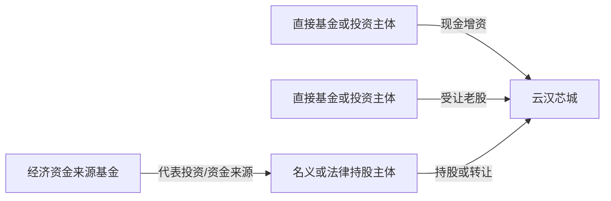
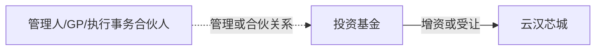
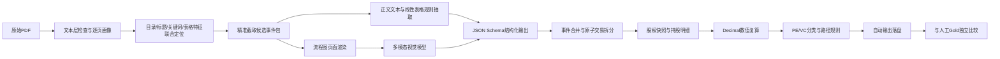

# 301563 云汉芯城招股说明书工程化研究

> 从原始PDF检查、章节定位和人工Gold构建，到股本时间线、增资与股权转让原子化、PE/VC投资路径识别、规则引擎及原始PDF全流程多模态自动抽取的完整单公司研究项目。

## 项目状态

**云汉芯城单公司范围内的研究任务已经完成。**

完成范围包括：

- 招股说明书PDF基础检查与双页码体系；
- 目标章节和关键页面定位；
- 候选资本事件识别；
- 单事件人工理解、标注和证据回源；
- 股本变化时间线；
- 增资、股权转让及股权结构快照；
- 数值勾稽与差异保留；
- PE/VC主体及投资路径识别；
- 已验收人工步骤的程序化复现；
- 从原始PDF开始的“文本规则 + 多模态视觉 + 确定性计算 + PE/VC规则引擎”自动抽取验证。

项目最终没有开放的人工复核事项。原始PDF自动结果与本项目人工验收Gold在主事件、交易原子明细、股权快照持股明细及PE/VC分类状态上全部匹配。

需要准确理解本项目的完成边界：

> 本项目已经证明该流程能够完整处理云汉芯城这一家公司；尚未通过第二家公司盲测证明所有规则具有跨公司通用性。流程图识别依赖支持图像输入的多模态模型环境，因此不属于完全离线、纯规则的无人系统。

---

## 一、项目目标

本项目以《云汉芯城（上海）互联网科技股份有限公司首次公开发行股票并在创业板上市招股说明书》为唯一主要事实来源，回答以下问题：

1. 公司自设立以来注册资本和股本如何演变？
2. 哪些事项属于增资、资本公积转增、整体变更或股权/股份转让？
3. 每次交易涉及哪些主体、金额、股份数量、价格及变更结果？
4. 关键时点的股东持股数量和比例如何变化？
5. 哪些主体属于PE/VC投资者，分别通过增资还是受让老股进入？
6. 基金、管理人、GP及执行事务合伙人之间的关系是否构成发行人权益路径？
7. 哪些结论来自原文直接披露，哪些属于程序计算，哪些信息未披露？
8. 如何把稳定的人工研究步骤转化为可验证、可复现的自动化流程？

本项目不是一次性让大模型阅读整本PDF后直接生成答案，而是将任务拆成可独立验收的阶段，并为每一步规定输入、处理、输出、证据和验收标准。

---

## 二、主要事实来源与页码规则

- 主要事实来源：`301563_云汉芯城_IPO招股说明书.pdf`
- PDF总页数：443页
- PDF SHA-256：`1631a3ad350e58f5516f83b229f9ec3506e86b13b8e0973a59353c8d4f038e04`
- 已确认页码关系：`PDF阅读器页码 = 正文印刷页码 + 1`
- 股本演变流程图主要位于PDF第56—58页，不能只依赖线性文本，需要视觉理解。
- 股份公司设立后的股东变化主要位于PDF第58—65页。
- 发行前股东结构主要位于PDF第91—93页。

所有业务结论原则上保存：

```text
事件ID
证据ID
PDF页码
正文页码
原文证据
原文披露值
标准化值
计算值
差异值
规则ID
程序版本
人工复核状态
```

README用于项目总览，字段级证据和原始摘录以各阶段最终工作簿、JSON及Bundle为准。

---

## 三、工程化方法：从全量PDF投喂LLM到代码定位、精准截取和配置化抽取

本项目没有将443页招股说明书整体交给大模型后直接要求生成最终答案，而是将长文档处理拆成可定位、可检查和可复现的连续步骤：

```text
原始PDF
→ 文本层与页面质量检查
→ 代码建立逐页索引
→ 目录、章节标题、关键词和表格特征联合定位
→ 精准截取候选章节、事件叙述、跨页表格和流程图
→ 生成候选事件包
→ 配置化规则与LLM/视觉模型协同抽取
→ 按JSON Schema输出结构化结果
→ 单位检查和数值Cross-check
→ 异常进入人工复核队列
→ 自动结果落盘后再与人工Gold比较
```

### 3.1 代码定位负责“去哪里找”

程序首先建立逐页画像，记录页码、文本长度、标题特征、关键词密度、表格特征及视觉处理需求，再结合目录和章节标题缩小目标范围。

本公司最终重点定位到：

- PDF第53—65页：公司设立、股本演变、增资及股权转让；
- PDF第56—58页：股本演变流程图；
- PDF第91—93页：发行前股东结构。

定位页码是云汉芯城本次运行的结果，不作为跨公司的固定页码。跨公司运行时，程序依据章节语义和标题模式重新识别实际页码。

### 3.2 精准截取负责“给模型看什么”

模型接收的不是整本PDF，而是围绕单一候选事项组织的局部材料，包括：

- 完整小标题；
- 事件说明及对应表格；
- 必要的连续跨页内容；
- 同一协议下的增资、股权转让和股权激励安排；
- 流程图关键页面。

候选事件包至少保留：

```text
candidate_id
company_code
section_title
PDF页码
正文页码
source_type
candidate_event_types
source_text或图片引用
source_hash
```

这种方式减少无关上下文，也能将错误定位到PDF解析、章节定位、候选切块、字段抽取或数值校验中的具体环节。

### 3.3 配置化规则驱动抽取，JSON Schema约束输出

“JSON配置抽取”在本项目中拆分为两个不同层次：

**配置化规则**负责规定：

- 目标章节标题和关键词；
- 无关章节过滤条件；
- 事件类型判断；
- 单位识别和转换；
- 哪些页面需要视觉处理；
- 数值校验和PE/VC分类规则。

**JSON Schema**负责约束：

- 字段名称和字段类型；
- 必填项与允许为空的字段；
- 枚举值；
- 事件、交易、快照、主体和证据之间的结构关系。

因此，本项目的准确表述是：

> 配置化规则驱动定位与抽取，规则/模型负责结构化理解，JSON Schema负责输出约束，数值规则负责结果校验。

### 3.4 MinerU、OCR、Markdown和视觉模型的使用边界

本项目没有为了统一工具而对整本PDF执行MinerU或OCR，而是根据页面类型选择解析路线：

```text
文本层完整
→ 直接提取文本

复杂版式、表格结构难以恢复
→ MinerU或专门表格解析器作为备用方案

扫描页、乱码页、文本提取为空
→ 仅对问题页执行OCR

包含节点和箭头关系的流程图
→ 页面渲染为图片后交给多模态视觉模型
```

云汉芯城PDF文本层可用，因此主路径采用直接文本提取；本公司没有将MinerU作为整本PDF的主解析器，也没有对443页全文执行OCR。PDF第56—58页的流程图则采用多模态视觉识别，因为其难点在于恢复节点和箭头关系，而不仅是识别文字。

Markdown主要用于保存：

- Prompt；
- 规则说明；
- 运行手册；
- 验证报告；
- GitHub项目说明。

结构化业务结果保存为JSONL、JSON、CSV和Excel。Markdown不替代PDF原文，也不作为唯一事实来源。

### 3.5 核心工程原则

- **拆解**：复杂任务拆成若干可验收的小阶段；
- **标准化**：固定事件、主体、证据、数值和状态字段；
- **可验证**：每个数字和判断都能回到PDF；
- **可复现**：同一输入和版本产生一致输出；
- **Human-in-the-loop**：人工负责歧义判断，程序负责重复和确定性工作；
- **禁止推算**：未披露信息不填零、不平均分配、不无依据倒推；
- **结果分层**：自动输出、人工Gold、差异比较、人工修正和最终结果分别保存。

---

## 四、阶段一至阶段九全流程


| 阶段 | 目标 | 主要处理 | 最终成果与验收结果 |
|---|---|---|---|
| 阶段1 | PDF基础检查 | 检查文本层、总页数、可搜索性、OCR需求和文件哈希 | 确认443页，文本层可用，无需整本OCR |
| 阶段2 | 章节定位 | 识别目录、目标章节、双页码和跨页边界 | 锁定发行人基本情况、股本演变、历次增资及股权转让、发行前股东结构 |
| 阶段3 | 候选事件识别 | 结合流程图、标题、表格和正文生成候选事件 | 形成主候选事件、流程图节点和证据索引 |
| 阶段4 | 单事件人工理解与标注 | 拆分复合事件，区分事实、判断和未披露项 | 完成`CE-001`至`CE-014`主事件及参与方、证据、数值标注 |
| 阶段5 | 股本变化时间线 | 将复合主事件展开为实际法律变化单元 | 形成17个实际股本变化单元和43个时间节点 |
| 阶段6 | 增资、转让和股权快照 | 交易原子化、主体标准化、关键时点股权结构重建 | 形成增资、转让、快照及持股明细结构化成果 |
| 阶段7 | 数值校验 | 区分披露值、标准化值、计算值和差异值 | 完成55项数值校验，保留CE-005差异，复核CE-013合计 |
| 阶段8 | PE/VC主体及投资路径 | 区分直接/间接、增资/受让、基金/GP/管理人 | 形成45个主体、33条投资记录和65条路径边 |
| 阶段9 | 稳定人工步骤自动化 | 输入适配、统一模型、规则引擎、异常队列、人工复核闭环 | 276条自动评价、35条业务规则、25项测试、0开放异常 |
| 最终扩展 | 从原始PDF自动抽取 | 文本规则处理正文，视觉模型处理流程图，再执行数值和PE/VC规则 | 14个主事件、48条原子交易、15个快照、201条持股、0开放复核 |

### 统计口径说明

不同阶段的数量代表不同粒度，并不矛盾：

| 数量 | 含义 |
|---:|---|
| 14个主事件 | 阶段四及原始PDF自动流程使用的主事件层，复合轮次仍作为一个主事件组 |
| 17个实际变化单元 | 阶段五把复合事件拆为增资、股权激励和老股转让等独立法律变化单元 |
| 48条原子交易 | 原始PDF自动输出的增资参与方、股权转让腿等业务明细 |
| 63条规范化交易记录 | 阶段九统一模型中的父事件、参与方及原子交易等多层记录合计 |
| 15个快照 + 201条持股 | 关键时点股权结构及逐股东明细，共216条快照相关记录 |
| 26个统一事件 | 阶段九为跨阶段引用和辅助关系建立的统一事件索引，包含业务主事件及辅助对象 |

---

## 五、公司股本与注册资本演变

公司注册资本由2008年设立时的50万元，经过增资、资本公积转增和整体变更，在本次发行前形成注册资本4,883.7074万元、总股本48,837,074股。

| 时间 | 事件ID | 事项 | 变更后注册资本/股本 | 证据页码（PDF / 正文） |
|---|---|---|---:|---|
| 2008-05-07 | `CE-001` | 有限公司设立 | 50万元 | 55—56 / 54—55 |
| 2009年12月 | `CE-002` | 深圳云汉电子转让全部股权；曾烨、刘云锋按原比例增资 | 100万元 | 56 / 55 |
| 2014年6月 | `CE-003` | 刘云锋向曾烨和为赛咨询转让股权 | 注册资本不变 | 56 / 55 |
| 2014年8月 | `CE-004` | 力源信息、东方富海、芜湖富海增资 | 128.205万元 | 56 / 55 |
| 2015年1月 | `CE-005` | 三名既有机构股东追加增资 | 原文136.9864万元 | 56 / 55 |
| 2015年3月 | `CE-006` | 资本公积按原比例转增 | 2,000万元 | 56 / 55 |
| 2015年8月 | `CE-007` | 深创投等六方增资 | 2,158.2733万元 | 57 / 56 |
| 2015-12-03 | `CE-008` | 整体变更为股份公司 | 4,000万元 / 4,000万股 | 53—55 / 52—54 |
| 2018年4月 | `CE-009` | 丰利财富将全部股份转让给天健创投 | 4,000万股不变 | 58—59 / 57—58 |
| 2018年6—7月 | `CE-010` | 外部增资、管理层股权激励和老股转让 | 4,635万元 / 4,635万股 | 59—61 / 58—60 |
| 2019年8月 | `CE-011` | 为赛咨询向李文发、秦国君转让股份 | 4,635万股不变 | 61—62 / 60—61 |
| 2020年5月 | `CE-012` | 火炬电子增资 | 4,748.0488万元 / 47,480,488股 | 62—63 / 61—62 |
| 2020年9月 | `CE-013` | 厦门西堤、中小企业基金增资并同步十笔老股转让 | 4,883.7074万元 / 48,837,074股 | 63—65 / 62—64 |
| 发行概况 | — | 公开发行16,279,025股新股 | 发行后65,116,099股 | 5、21 / 4、20 |

### 17个实际股本变化单元

<details>
<summary>展开完整事件单元</summary>

| 序号 | 事件ID | 时间 | 事件类型 | 事项摘要 |
|---:|---|---|---|---|
| 1 | `CE-001` | 2008-05-07 | 公司设立 | 深圳云汉电子、刘云锋各认缴25万元、各持股50% |
| 2 | `CE-002-01` | 2009年12月 | 股权转让 | 深圳云汉电子将全部50%股权转让给曾烨并退出 |
| 3 | `CE-002-02` | 2009年12月 | 增资 | 曾烨、刘云锋按原持股比例合计增资50万元，注册资本增至100万元 |
| 4 | `CE-003` | 2014年6月 | 股权转让 | 刘云锋分别向曾烨、为赛咨询转让15.75%、6.85%股权 |
| 5 | `CE-004` | 2014年8月 | 增资 | 力源信息、东方富海、芜湖富海共同增资28.205万元 |
| 6 | `CE-005` | 2015年1月 | 增资 | 三名既有机构股东共同追加增资8.78714万元 |
| 7 | `CE-006` | 2015年3月 | 资本公积转增 | 按原持股比例以资本公积转增，注册资本增至2,000万元 |
| 8 | `CE-007` | 2015年8月 | 增资 | 深创投等六方共同增资158.2733万元 |
| 9 | `CE-008` | 2015-12-03 | 整体变更 | 经审计净资产折为4,000万股，设立股份公司 |
| 10 | `CE-009` | 2018-04-28 | 股份转让 | 丰利财富将666,680股全部转让给天健创投，价款1,000万元 |
| 11 | `CE-010-01` | 2018年6—7月 | 外部增资 | 国科瑞华等六方现金认缴新增注册资本 |
| 12 | `CE-010-02` | 2018年6月 | 股权激励增资 | 李文发、秦国君、李剑峰、周雪峰合计认缴120万元 |
| 13 | `CE-010-03` | 2018年6月 | 股份转让 | 曾烨、刘云锋向富海节能、临港投资、鸿迪投资实施四笔转让 |
| 14 | `CE-011` | 2019年8月 | 股份转让 | 为赛咨询向李文发、秦国君各转让40万股 |
| 15 | `CE-012` | 2020年5月 | 增资 | 火炬电子投资5,000万元认购1,130,488股 |
| 16 | `CE-013-01` | 2020年9月 | 增资 | 厦门西堤、中小企业基金分别投资5,000万元、2,000万元 |
| 17 | `CE-013-02` | 2020年9月 | 股份转让 | 四名转让方向八名受让主体实施十笔股份转让 |

</details>

---

## 六、主要增资与融资轮次

| 事件 | 投资方 | 投资/认缴 | 价格与估值 | 进入性质 |
|---|---|---|---|---|
| `CE-004` 2014年8月 | 力源信息、东方富海、芜湖富海 | 原文仅披露合计新增注册资本28.205万元 | 未披露 | 三名新股东进入 |
| `CE-005` 2015年1月 | 上述三名既有机构股东 | 合计新增注册资本8.78714万元 | 未披露 | 追加增资 |
| `CE-007` 2015年8月 | 深创投、丰利财富、镇江红土、昆山红土、富海深湾、芜湖富海 | 合计新增注册资本158.2733万元 | 未披露 | 五名新股东进入，芜湖富海追加增资 |
| `CE-010-01` 2018年6—7月 | 国科瑞华、CASREV FUND、中科贵银、夏东、南山富海、珠海拓域 | 现金合计15,000万元，认缴新增注册资本合计515万元 | 约29.13元/股；投后估值约13.5亿元 | 外部投资人增资进入 |
| `CE-010-02` 2018年6月 | 李文发、秦国君、李剑峰、周雪峰 | 合计120万元，认缴120万元注册资本 | 1元/股 | 管理团队股权激励 |
| `CE-012` 2020年5月 | 火炬电子 | 投资5,000万元，认购1,130,488股 | 约44.23元/股；投后估值约21亿元 | 产业战略投资主体增资进入 |
| `CE-013-01` 2020年9月 | 厦门西堤、中小企业基金 | 分别投资5,000万元、2,000万元，认购968,990股、387,596股 | 约51.6元/股；投后估值约25.2亿元 | 增资进入 |

### 披露值与计算值的边界

- 2009年增资原文披露“按原持股比例”合计增资50万元。曾烨、刘云锋各25万元属于确定性计算值，不是逐方原文披露值。
- 2014年和2015年早期共同增资未披露逐方金额，不进行平均分配。
- `CE-006`属于资本公积转增，不认定为外部现金融资。
- `CE-010-02`属于管理团队股权激励，和同轮外部财务投资分开保存。

---

## 七、股权与股份转让

| 事件 | 转让安排 | 数量/比例 | 价款 | 结果 |
|---|---|---:|---:|---|
| `CE-002-01` | 深圳云汉电子 → 曾烨 | 50%股权 | 未披露 | 深圳云汉电子退出，曾烨进入 |
| `CE-003` | 刘云锋 → 曾烨、为赛咨询 | 15.75%、6.85%股权 | 未披露 | 为赛咨询进入，刘云锋继续持股 |
| `CE-009` | 丰利财富 → 天健创投 | 666,680股 | 1,000万元 | 丰利财富退出，天健创投进入 |
| `CE-010-03` | 曾烨、刘云锋 → 富海节能、临港投资、鸿迪投资 | 合计1,158,750股 | 合计3,375.0054万元（计算值） | 三名受让方进入 |
| `CE-011` | 为赛咨询 → 李文发、秦国君 | 合计800,000股 | 合计80万元（计算值） | 两名受让方增持，为赛咨询仍持股 |
| `CE-013-02` | 曾烨、刘云锋、李文发、秦国君 → 八名受让主体 | 合计1,659,535股 | 合计8,563.19万元（计算值） | 七名新受让方进入，鸿迪投资追加受让 |

2020年9月十笔股份转让已逐笔拆分。四名转让方在转让后均继续持股，没有被误标为全部退出。

---

## 八、关键持股比例变化

2015年比例为原文披露；2018年和发行前比例为持股数除以当期总股本的计算值。

| 股东 | 2015整体变更 | 2018复合轮次后 | 发行前 | 主要变化 |
|---|---:|---:|---:|---|
| 曾烨 | 17,792,000股 / 44.48% | 17,096,750股 / 36.89% | 16,132,255股 / 33.03% | 老股转让与后续增资稀释共同导致比例下降 |
| 刘云锋 | 7,413,360股 / 18.53% | 6,949,860股 / 14.99% | 6,454,820股 / 13.22% | 多次转让并受增资稀释 |
| 力源信息 | 5,004,000股 / 12.51% | 5,004,000股 / 10.80% | 5,004,000股 / 10.25% | 股数不变，比例被动稀释 |
| 芜湖富海 | 2,835,320股 / 7.09% | 2,835,320股 / 6.12% | 2,835,320股 / 5.81% | 股数不变，比例被动稀释 |
| 东方富海 | 2,502,000股 / 6.26% | 2,502,000股 / 5.40% | 2,502,000股 / 5.12% | 股数不变，比例被动稀释 |
| 国科瑞华 | — | 2,544,787股 / 5.49% | 2,544,787股 / 5.21% | 2018年增资进入 |
| 深创投 | 933,320股 / 2.33% | 933,320股 / 2.01% | 933,320股 / 1.91% | 2015年增资进入，后续比例稀释 |
| 火炬电子 | — | — | 1,130,488股 / 2.31% | 2020年5月增资进入 |

发行前总股本为48,837,074股，34名股东持股数量合计与披露总股本一致。

---

## 九、PE/VC主体与投资路径

### 分类结果

| 状态 | 数量 | 含义 |
|---|---:|---|
| `CONFIRMED` | 12 | 招股说明书证据足以确认的PE/VC核心主体 |
| `CANDIDATE` | 6 | 具有投资特征，但披露不足以确认PE/VC性质 |
| `RELATED` | 8 | 管理人、GP、执行事务合伙人或其他关系主体 |
| `EXCLUDED` | 17 | 创始人、员工平台、自然人或产业经营主体等 |
| `UNRESOLVED` | 2 | 招股说明书披露不足，保留未知 |

阶段八及最终自动结果形成：

- 45个主体；
- 33条投资记录；
- 65条投资路径边；
- 12个确认PE/VC核心主体；
- 13条投资记录因个体金额或分配未披露而保持空值。

### 已确认的主要PE/VC核心主体

- 东方富海（上海）创业投资企业（有限合伙）
- 芜湖富海浩研创业投资基金（有限合伙）
- 富海深湾（深圳）移动创新私募创业投资基金合伙企业（有限合伙）
- 北京国科瑞华战略性新兴产业投资基金（有限合伙）
- 中科贵银（贵州）产业投资基金（有限合伙）
- 中小企业发展基金（深圳南山有限合伙）
- 深圳南山东方富海中小微创业投资基金合伙企业（有限合伙）
- 珠海拓域壹号股权投资基金（有限合伙）
- 深圳东方富海节能环保创业投资基金合伙企业（有限合伙）
- 上海临港松江股权投资基金合伙企业（有限合伙）
- 厦门富海天健创业投资合伙企业（有限合伙）
- 丰利财富新三板成长基金（经济资金来源基金，非直接股东）

完整主体清单、候选状态、证据页码和投资路径见阶段八工作簿及最终Bundle。

### 路径判断规则



管理人、GP或执行事务合伙人关系只作为背景关系边：



管理关系本身不自动形成发行人权益路径。只有招股说明书明确披露资金或权益传导时，才建立相应经济投资路径。

---

## 十、数值校验

阶段七和阶段九使用确定性公式对注册资本、股份数、持股比例、转让价款、价格及估值进行复算。

| 校验事项 | 原文披露值 | 程序计算值 | 结论 |
|---|---:|---:|---|
| `CE-005`增资后注册资本 | 136.9864万元 | 128.205 + 8.78714 = 136.99214万元 | 差异0.00574万元；保留原文和差异，不静默修改 |
| `CE-013`十笔转让股数 | 1,659,535股 | 1,659,535股 | 一致 |
| `CE-013`十笔转让价款 | 原文逐笔披露 | 8,563.19万元 | 逐笔加总结果 |
| 发行前总股本 | 48,837,074股 | 34名股东持股合计48,837,074股 | 一致 |

阶段七共完成55项数值校验。程序区分：

```text
原文披露值
标准化值
程序计算值
差异值
人工复核结论
```

---

## 十一、阶段九：已验收成果驱动的渐进式自动化

阶段九首先将阶段一至阶段八的人工验收成果接入统一模型，再实现稳定步骤的程序化复现。

```text
输入登记和SHA-256冻结
→ 分阶段适配器
→ 统一事件/主体/证据/交易/快照模型
→ 数值、交易和PE/VC规则引擎
→ 异常队列
→ 人工复核工作簿
→ 复核决定导入
→ 最终测试和确定性复现
```

### 结果规模

| 对象 | 数量 |
|---|---:|
| 阶段一至阶段八来源记录 | 1,648 |
| 统一事件 | 26 |
| 统一主体 | 45 |
| 统一证据 | 126 |
| 规范化交易 | 63 |
| 快照及持股记录 | 216 |
| 数值校验 | 55 |
| 投资记录 | 33 |
| 投资路径边 | 65 |
| 自动业务评价 | 276 |
| 业务规则 | 35条全部通过 |
| 人工复核动作 | 17条全部有效关闭 |
| 最终测试 | 25项全部通过 |
| 开放异常 | 0 |

这一部分证明：已经稳定的人工Gold能够被程序读取、复算、交叉检查并通过人工复核闭环发布。

---

## 十二、原始PDF全流程多模态自动抽取

在渐进式自动化完成后，项目进一步把入口前移到原始PDF。

### 自动处理架构



自动抽取阶段只读取原始PDF及冻结的配置规则。阶段六至阶段九的验收成果只在自动输出已经持久化后用于独立评价，不反向参与章节定位、候选切块、事件识别或字段抽取。

在逻辑上，候选事件包是PDF定位与结构化抽取之间的中间层。当前包通过页面画像、章节定位结果、截取文本、流程图图片及模型原始输出保留该过程；跨公司版本将进一步把候选事件包单独固化为JSONL文件，便于逐候选评估定位召回率和事件抽取准确率。

### 自动化结果

| 对象 | 自动结果 | Gold对照 | 结果 |
|---|---:|---:|---:|
| 主事件 | 14 | 14 | Precision / Recall = 100% / 100% |
| 交易原子明细 | 48 | 48 | Precision / Recall = 100% / 100% |
| 股权快照 | 15 | 15 | 全部覆盖 |
| 快照持股行 | 201 | 201 | 逐行精确匹配100% |
| 数值校验 | 55 | 55 | 全部生成 |
| PE/VC主体 | 45 | 45 | 分类状态全部匹配 |
| 投资记录 | 33 | 33 | 全部生成 |
| 投资路径边 | 65 | 65 | 全部生成 |
| 开放人工复核 | 0 | — | 无开放项 |

上述100%是针对云汉芯城这一家公司与本项目人工验收Gold的匹配结果，不代表在未测试的其他招股说明书上也能达到相同准确率。

### 流程图视觉处理

普通文本层不能完整恢复PDF第56—58页的流程图关系，因此流程采用多模态视觉模型：

- 输入：三张流程图页面图片；
- 输出：2009年12月至2015年8月的6个主事件及相关参与方、交易和快照；
- 留存：视觉Prompt、输入图片SHA-256、原始结构化输出和模型记录；
- 后处理：程序执行事件合并、字段标准化和数值规则；
- 最终开放人工复核：0。

该步骤属于模型辅助自动化。视觉模型环境不可用时，可复现文本规则、合并、校验和打包，但需要重新提供相同结构的视觉模型输出。

---

## 十三、自动化边界

### 可以稳定自动化

- 文件存在性、大小和SHA-256校验；
- PDF文本层读取和页面画像；
- 章节、小标题和目标页面定位；
- 已知格式的正文事件和线性表格抽取；
- 增资参与方和转让原子腿拆分；
- 主键、外键、事件、主体和证据引用检查；
- 日期、金额、股数、比例和单位标准化；
- Decimal确定性计算；
- 注册资本、股份合计和快照勾稽；
- 已确认名称映射；
- 声明式PE/VC分类和路径规则；
- 异常队列、Excel、JSON、报告和manifest生成；
- 自动结果与Gold的量化比较。

### 仍然依赖模型或研究判断

- 图片流程图和复杂跨页图表的语义恢复；
- 新公司中未知版式的事件边界判断；
- 仅凭名称无法确认的PE/VC性质；
- 缺少原文证据时的同一主体合并；
- 管理关系是否形成经济权益传导；
- 原文歧义、法律效果冲突和重大披露差异；
- 跨公司规则迁移后的最终验收。

---

## 十四、仓库结构

仓库根目录只保留本README，各阶段内部README可以不提交。建议目录如下：

```text
.
├── README.md
├── yunhan-ipo-engineering/                              # 阶段1-2
├── 301563_stage3_acceptance_v1.0.0/                    # 阶段3
├── stage04_minimal_reclassified/                       # 阶段4
├── stage05_equity_change_timeline_engineering/         # 阶段5
├── stage06_equity_transactions_and_snapshots_github_compact/ # 阶段6
├── stage07_numeric_validation_github_compact/          # 阶段7
├── stage08_pevc_investment_paths/                      # 阶段8
├── stage09_progressive_automation/                     # 阶段9：人工Gold驱动自动化
└── stage09_raw_pdf_full_automation/                    # 原始PDF全流程自动抽取
```

### 核心成果入口

- [阶段1：PDF基础检查](yunhan-ipo-engineering/docs/01_pdf_basic_check.md)
- [阶段2：章节定位](yunhan-ipo-engineering/docs/02_section_location.md)
- [阶段3：候选事件识别](301563_stage3_acceptance_v1.0.0/docs/03_candidate_event_identification.md)
- [阶段4：最终事件标注工作簿](stage04_minimal_reclassified/data/stage04_CE001_CE014_final_approved.xlsx)
- [阶段5：股本变化时间线](stage05_equity_change_timeline_engineering/deliverables/stage05_equity_change_timeline_final_approved.xlsx)
- [阶段6：增资、转让和股权快照](stage06_equity_transactions_and_snapshots_github_compact/deliverables/stage06_equity_transactions_and_snapshots_final_approved.xlsx)
- [阶段7：数值校验](stage07_numeric_validation_github_compact/deliverables/stage07_numeric_validation_final_approved.xlsx)
- [阶段8：PE/VC投资路径](stage08_pevc_investment_paths/data/stage08_pevc_investment_paths.xlsx)
- [阶段9：渐进式自动化工作簿](stage09_progressive_automation/deliverables/stage09_automation_final_approved.xlsx)
- [阶段9：渐进式自动化Bundle](stage09_progressive_automation/data/stage09_automation_bundle.json)
- [原始PDF自动化最终工作簿](stage09_raw_pdf_full_automation/final/301563_raw_pdf_full_automation.xlsx)
- [原始PDF自动化最终Bundle](stage09_raw_pdf_full_automation/final/301563_raw_pdf_full_automation_bundle.json)
- [原始PDF自动化验证报告](stage09_raw_pdf_full_automation/reports/validation_summary.md)
- [原始PDF自动化运行手册](stage09_raw_pdf_full_automation/reports/runbook.md)

如果GitHub中的实际文件夹名称不同，应同步修改上述相对链接。

---

## 十五、复现方式

### 1. 渐进式自动化验证

```bash
cd stage09_progressive_automation
python -m pip install -e .
stage09 verify-final --bundle data/stage09_automation_bundle.json
python -m unittest discover -s tests -v
```

预期结果：

- 35条业务规则全部通过；
- 25项测试全部通过；
- 开放异常为0；
- 相同输入、规则集和程序版本产生相同核心业务输出。

### 2. 原始PDF自动抽取结果验证

原始PDF不重复放入GitHub提交包。运行前应把PDF放在本地输入目录，并核对SHA-256。

```bash
cd stage09_raw_pdf_full_automation
python -m pip install -e .
python -m raw_pdf_full_pipeline.cli_full \
  --bundle final/301563_raw_pdf_full_automation_bundle.json
pytest -q
```

核心目录：

```text
outputs/auto/                 未经人工修改的自动结果
outputs/raw_model_outputs/    视觉模型原始结构化输出
outputs/comparison/           自动结果与Gold的比较
final/                        最终Excel和机器数据Bundle
reports/                      验证报告和运行手册
```

---

## 十六、最终交付哈希

### 渐进式自动化

- 最终Bundle SHA-256：`e1fedd57b3d52ed729d4763731238530b40a808de43d8f95e16d86368192c1d2`
- 最终工作簿 SHA-256：`58bd89ef122d964b69fd217d11418c75fca09f27aef09c6f878a0ccd4990b0c2`

### 原始PDF全流程自动化

- 最终Bundle SHA-256：`087d60e601f350ca0b8d2c605d2597a6a916a0f72801d4e1054b826223d16068`
- 最终工作簿 SHA-256：`6620b7c594c28ba34226cd9cbed2a80f283b67a89ba09ed36bb0819a0e7325c8`
- GitHub精简提交包生成状态：`FINAL_SUBMISSION_READY`

---

## 十七、完成判定

本项目按照以下标准宣告云汉芯城单公司任务完成：

- [x] PDF基础检查和页码体系通过验收；
- [x] 目标章节和关键证据页面定位完成；
- [x] 所有主事件完成证据回源和人工标注；
- [x] 复合事件完成增资、股权激励和转让腿拆分；
- [x] 股本时间线和关键快照完整；
- [x] 数值差异均保留公式、输入、计算值和处理结论；
- [x] PE/VC主体和投资路径完成分类；
- [x] 人工Gold驱动的规则自动化完成；
- [x] 异常队列和人工复核闭环完成；
- [x] 原始PDF自动抽取完成；
- [x] 自动结果与人工Gold完成独立比较；
- [x] 最终Excel、JSON、代码、Prompt、测试和报告已形成；
- [x] 开放人工复核事项为0。

最终结论：

> 本项目已经完成云汉芯城上市前股本变化、增资、股权转让、股权结构及PE/VC投资路径的人工Gold构建、数值验证、程序化复现和原始PDF自动抽取。后续工作不再属于该公司结果补全，而属于跨公司迁移测试和通用系统建设。

---

## 十八、研究限制与后续方向

- 本项目不使用外部工商、基金备案、新闻或商业数据库补充招股说明书未披露的信息。
- `CANDIDATE`和`UNRESOLVED`表示证据不足，不是负面判断。
- 未披露基金LP、内部出资比例、最终受益人、个体投资金额、退出收益和投资回报率均未推算。
- 名称相似、同一管理人或注册地址接近，不能单独证明同一主体或控制关系。
- 自动流程对云汉芯城Gold达到100%匹配，不代表跨公司准确率。
- 下一步将冻结当前程序、规则、Prompt和Schema版本，对剩余七家公司统一执行首次自动运行；首次结果全部落盘后，再制作或查看人工Gold，报告章节定位召回率、候选事件召回率、字段准确率、数值校验通过率和人工复核率。

---

## License / 使用说明

本仓库用于IPO招股说明书工程化学习和研究展示。招股说明书原文版权及相关权利归原发布主体所有；仓库中的结构化数据、代码和研究结论应结合原始披露文件审慎使用。
